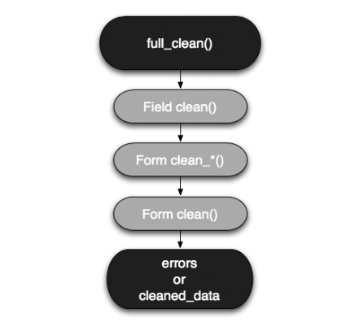

Date:2012/04/18
#django：form验证的顺序

1、django框架提供了一个forms类，来处理web开发中的表单相关事项。众所周知，form最常做的是对用户输入的内容进行验证，为此django的forms类提供了全面的内容验证支持。

2、一个完整的form验证过程如下：  

  

1. 函数full_clean()依次调用每个field的clean()函数，该函数针对field的max_length，unique等约束进行验证，如果验证成功则返回值，否则抛出ValidationError错误。如果有值返回，则放入form的cleaned_data字典中。

2. 如果每个field的内置clean()函数没有抛出ValidationError错误，则调用以clean_开头，以field名字结尾的自定义field验证函数。验证成功和失败的处理方式同步骤1。

3. 最后，调用form的clean()函数——注意，这里是form的clean(),而不是field的clean()——如果clean没有错误，那么它将返回cleaned_data字典。

4. 如果到这一步没有ValidationError抛出，那么cleaned_data字典就填满了有效数据。否则cleaned_data不存在，form的另外一个字典errors填上验证错误。在template中，每个field获取自己错误的方式是：{{ form.username.errors }}。

5. 最后，如果有错误is_valid()返回False，否则返回True。

3、来看一个form的验证实例，用户注册表单，它需要做一下几个方面的验证：

1. 用户名是否为字符串，邮箱是否符合邮件地址格式，password是有效字母

2. 用户名是否占用

3. 两次输入的passwod是否相同

django的form来实现这个需求的代码如下：

	from django.contrib.auth.models import User
	from django import forms
	class SignupForm(forms.Form):
    	username = forms.CharField(max_length=30)
    	email = forms.EmailField()
    	password1 = forms.CharField(max_length=30,
    	widget=forms.PasswordInput(render_value=False))
    	password2 = forms.CharField(max_length=30,
    	widget=forms.PasswordInput(render_value=False))
 
    	def clean_username(self):
        	try:
            	User.objects.get(username=self.cleaned_data['username'])
        	except User.DoesNotExist:
            	return self.cleaned_data['username']
        	raise forms.ValidationError("This username is already in use.")
 
    	def clean(self):
        	if 'password1' in self.cleaned_data and 'password2' in self.cleaned_data:
            	if self.cleaned_data['password1'] != self.cleaned_data['password2']:
                	raise forms.ValidationError("You must type the same password each time")
        	return self.cleaned_data
 
    	def save(self):
        	new_user = User.objects.create_user(username=self.cleaned_data['username'],                     				email=self.cleaned_data['email'],password=self.cleaned_data['password1'])