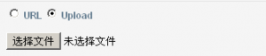

Date:2012/04/25
#django一次值得记录的ModelForm Hacking

经过两天时间的奋战，终于完成了对django中ModelForm的hack。中间曾多次想退缩，但最终坚持了下来，学到的东西不能丢掉，这里做个总结。

##需求：

提供两种上传图片的方式，url和本地文件上传。具体如图：

  

##实现：

如上图所示，需要添加一个RadioSelect和一个UrlField以及将ImageField设置成required=False。这种情况下可以将RadioSelect和UrlField添加进Item模型中，但单选按钮和UrlField并不是Item的一部分，它们只是用来添加Item的Image的。因此，我选择对ModelForm进行hack，代码如下：  
	
	from django import forms
	from items.models import Item, Category
	from urlparse import urlparse
	from django.core.files import File
	from django.core.files.temp import NamedTemporaryFile
	from django.core.files.base import ContentFile
	import urllib2, imghdr, re
	from django.utils.safestring import mark_safe
 
	class HorizRadioRenderer(forms.RadioSelect.renderer):
    	""" this overrides widget method to put radio buttons horizontally
        	instead of vertically.
        	from: http://t.cn/zOlVJDc
    	"""
    		def render(self):
            	"""Outputs radios"""
            	return mark_safe(u'\n'.join([u'%s\n' % w for w in self]))
	class ItemForm(forms.ModelForm):
 
    	UPLOAD_URL = 1
    	UPLOAD_FILE = 2
    	CHOICES = ((UPLOAD_URL, 'URL'), (UPLOAD_FILE, '上传'))
 
    	urlorupload = forms.TypedChoiceField(
        	choices=CHOICES,
        	initial=UPLOAD_FILE,
        	widget = forms.RadioSelect(renderer=HorizRadioRenderer),
        	coerce=int,
        	)
 
    	imageurl = forms.URLField(required=False)
 
    	class Meta:
        	model = Item
        	fields = ('category', 'name', 'description', 'image', 'url', 'tags', 'public', 'fullfilled')
 
    	def __init__(self, *args, **kwargs):
        	self.request = kwargs.pop('request')
        	super(ItemForm, self).__init__(*args, **kwargs)
        	self.fields['image'].required = False
        	self.fields['category'].queryset = self.request.user.items_category_set.all()
 
    	def clean(self):
      		if self.cleaned_data['urlorupload'] == ItemForm.UPLOAD_URL:
           		if 'imageurl' in self.cleaned_data and self.cleaned_data['imageurl'] == '':
                	raise forms.ValidationError(u"图片网址不正确")
        		else:
            		if self.cleaned_data.get('image') == None:
                		raise forms.ValidationError(u"请选择一个图片")
 
       	 	return self.cleaned_data
 
    	def save(self, commit=True):
 
        	item = super(ItemForm, self).save(commit=False)
        	item.user = self.request.user
 
        	if self.cleaned_data.get('imageurl') and not self.cleaned_data.get('image'):
 
            	image_url = self.cleaned_data.get('imageurl', 'http://img1.douban.com/mpic/s9022453.jpg')
            	image_temp = NamedTemporaryFile()
            	image_temp.write(urllib2.urlopen(image_url).read())
            	image_temp.flush()
 
            	item.image.save(
               		urlparse(image_url).path.split('/')[-1], 
                	File(image_temp),
                	save=False
                	)
 
        	if commit:
            	item.save()
        	return item  

上述代码主要对ModelForm做了一下几个方面的hack：
1、添加了两个额外的field，添加方式跟普通Form定义field相同。由于Django默认将RadioSelect显示成垂直排列的，本文通过设置RadioSelect的render参数把它变成了水平排列，而这里的TypedChoiceField则可以把RadioSelect中选项的数值强制转换成了int类型。代码如下：
	  
	class HorizRadioRenderer(forms.RadioSelect.renderer):
    """ this overrides widget method to put radio buttons horizontally
        instead of vertically.
        from: http://t.cn/zOlVJDc
    """
    	def render(self):
            """Outputs radios"""
            return mark_safe(u'\n'.join([u'%s\n' % w for w in self]))
 
		UPLOAD_URL = 1
    	UPLOAD_FILE = 2
    	CHOICES = ((UPLOAD_URL, 'URL'), (UPLOAD_FILE, '上传'))
 
    	urlorupload = forms.TypedChoiceField(
        	choices=CHOICES,
        	initial=UPLOAD_FILE,
        	widget = forms.RadioSelect(renderer=HorizRadioRenderer),
        	coerce=int,
        	)
2、覆盖了ModelForm的构造函数__init__，目的是将ImageField的required设置成False，设置category的queryset，并将request作为参数传进来。代码如下：

	 
	def __init__(self, *args, **kwargs):
        self.request = kwargs.pop('request')
        super(ItemForm, self).__init__(*args, **kwargs)
        self.fields['image'].required = False
        self.fields['category'].queryset = self.request.user.items_category_set.all()
3、由于ImageField在数据库中是required，因此url和上传两者必选其一，为了在view中调用form.is_valid()的时候对此规则进行验证，重写了clean()方法。如下：

	def clean(self):
        # 如果提供了一个图片网址，则检测该网址是否正确
        if self.cleaned_data['urlorupload'] == ItemForm.UPLOAD_URL:
            if 'imageurl' in self.cleaned_data and self.cleaned_data['imageurl'] == '':
                raise forms.ValidationError(u"图片网址不正确")
 
        # 如果选择上传的方式，则检查是否选择了文件
        else:
            if self.cleaned_data.get('image') == None:
                raise forms.ValidationError(u"请选择一个图片")
 
        return self.cleaned_data
4、重写了save()方法，代码如下：

	def save(self, commit=True):
 
        item = super(ItemForm, self).save(commit=False)
        item.user = self.request.user
 
        if self.cleaned_data.get('imageurl') and not self.cleaned_data.get('image'):
 
            image_url = self.cleaned_data.get('imageurl', 'http://img1.douban.com/mpic/s9022453.jpg')
            image_temp = NamedTemporaryFile()
            image_temp.write(urllib2.urlopen(image_url).read())
            image_temp.flush()
 
            item.image.save(
                urlparse(image_url).path.split('/')[-1], 
                File(image_temp),
                save=False
                )
 
        if commit:
            item.save()
        return item
创建Item的view如下：

	def create_item(request, success_url=None, template_name='items/createitem.html', extra_context=None):
    	if request.method == 'POST':
        	if 'image' in request.FILES:
            	form = ItemForm(request.POST, request.FILES,request=request)
        	else: 
            	form = ItemForm(request.POST,request=request)
 
        	if form.is_valid():
            	itm = form.save()
            	if success_url is None:
                	success_url = itm.get_absolute_url()
            	return HttpResponseRedirect(success_url)
    	else:
        	form = ItemForm(request=request)
 
    	if extra_context is None:
        	extra_context = {}
    	context = RequestContext(request)
    	for key, value in extra_context.items():
        	context[key] = callable(value) and value() or value
 
    	return render_to_response(
        	template_name,
        	{'form': form, 'add': True},
        	context_instance = context
        	)