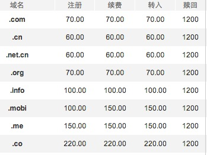
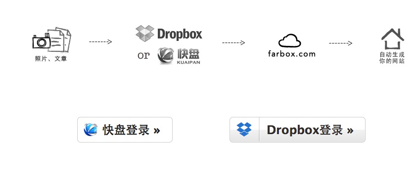
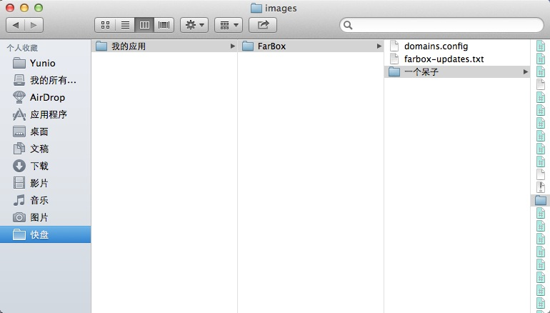
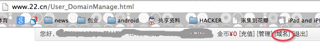
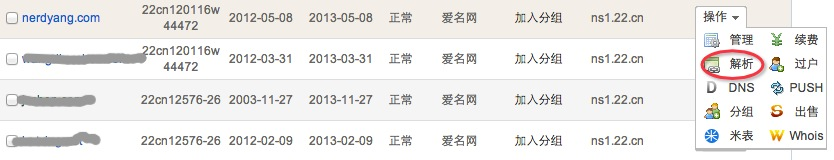
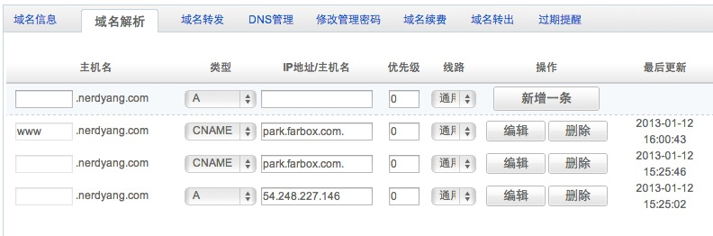
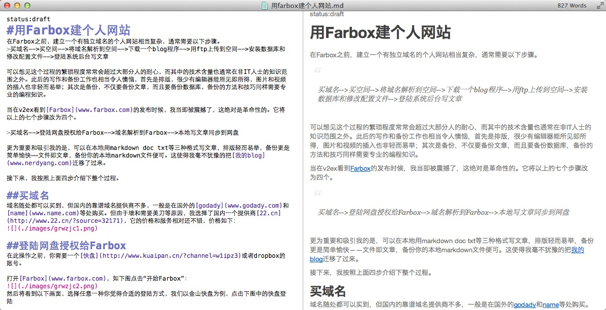

  
#用Farbox建个人网站
在Farbox之前，建立一个有独立域名的个人网站相当复杂，通常需要以下步骤。
>买域名-->买空间-->将域名解析到空间-->下载blog程序-->用ftp上传到空间-->安装和设置数据库-->修改配置文件-->登陆系统后台写文章  

可以想见这个过程的繁琐程度常常会超过大部分人的耐心，而其中的技术含量也通常在非IT人士的知识范围之外。这些步骤之后的写作和备份工作也相当令人懊恼，首先是排版，很少有编辑器能所见即所得，图片和视频的插入也非轻而易举；其次是备份，不仅要备份文章，而且要备份数据库，备份的方法和技巧同样需要专业的编程知识。

当在[v2ex](http://www.v2ex.com/?r=yanng)看到[Farbox](www.farbox.com)发布的时候，我当即被震撼了，绝对是革命性的，她将以上的八个步骤降低为四个，而且不需要什么特别的技术。  

>买域名-->用网盘登陆Farbox-->域名解析-->本地写文章同步到网盘

更为重要和吸引我的是，可以在本地用markdown、doc、txt等三种格式写文章，排版轻而易举，备份更是简单愉快——文件即文章。这使得我毫不犹豫的把[我的blog](www.nerdyang.com)迁移了过来。

接下来，按照上面四步介绍下整个过程。

##买域名
域名随处都可以买到，但国内的靠谱域名提供商不多，一般是在国外的[godady](www.godady.com)和[name](www.name.com)等处购买。但由于墙和需要美刀等原因，我选择了国内一个提供商[22.cn](http://www.22.cn/?source=32171)，它的价格和服务相对还不错，价格如下，支付宝便可购买。  

##用网盘登陆Farbox
在此操作之前，你需要一个[金山快盘](http://www.kuaipan.cn/?channel=w1ipz3)或者[dropbox](http://db.tt/g16j6OrH)的账号。  

打开[Farbox](www.farbox.com)，点击“开始Farbox”，如下图：  
  
选择任意一种你觉得合适的登陆方式，我以[金山快盘](http://www.kuaipan.cn/?channel=w1ipz3)为例，点击下图中的快盘登陆  
  
  

完成之后，Farbox会在快盘目录下建立“快盘/我的应用/Farbox/blof”文件夹，下图是我下载了快盘客户端之后的文件夹：  

  
##域名解析
域名解析需要以下两个步骤:  

1. 在域名提供商后台设置域名解析，以[22.cn](http://www.22.cn/?source=32171)为例。登陆之后在页面上方，点击域名，如图所示：  
  
  找到注册的域名，选择解析，如图所示：  
  
    然后依次解析cname和A记录到途中的网址：  
  
2. 在网盘目录“快盘/我的应用/Farbox/一个呆子”中新建名为“domains.config”的文件，内容如下：    

		nerdyang.com  
网盘目录最内层的“一个呆子”为[我的blog](www.nerdyang.com)的名称。  
这样就解析完成了。  

##本地写文章同步到网盘  
到了享受写作过程的时刻了。  
我在mac下用Mou写的这篇文章，如你所料，写完之后保存在本地网盘目录，网盘会自动同步到云端。这样一篇文章就发布成功了！所见即所得，如下图所示：
  
至于其他的细节，请参看[Farbox的帮助](http://farbox.com/docs.md)